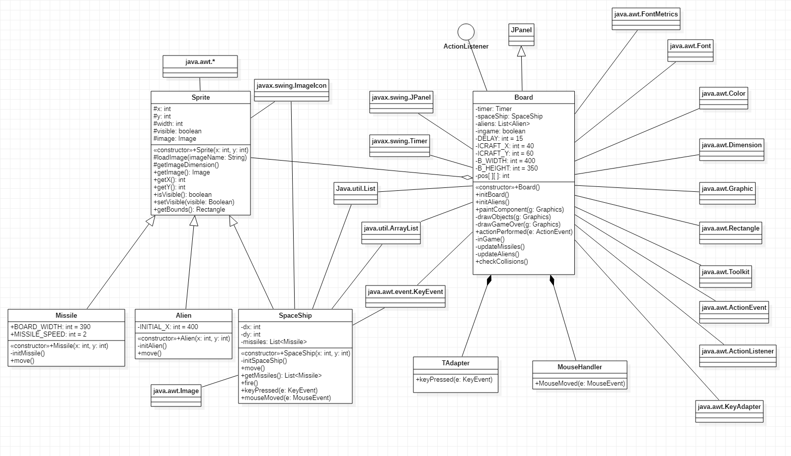
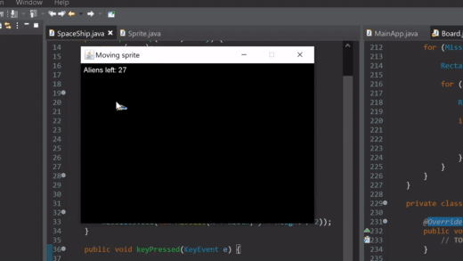

# Collision Detection with Mouse

Project ini sama seperti project sebelumnya yaitu Collision Detection namun diubah kontrol dari Sprite Spaceship dengan menggunakan mouse.

### Class yang dimodifikasi di project ini
*  Board
*  SpaceShip

## Board
Modifikasi yang dilakukan di class ini adalah menambahkan listener untuk Mouse Motion `addMouseMotionListener(new MouseHandler());` pada `initBoard()`.
* `initBoard()`
```java
private void initBoard() {

        addKeyListener(new TAdapter());
        addMouseMotionListener(new MouseHandler());

            
        setBackground(Color.BLACK);
        setFocusable(true);
        ingame = true;

        setPreferredSize(new Dimension(B_WIDTH, B_HEIGHT));

        spaceShip = new SpaceShip(ICRAFT_X, ICRAFT_Y);

        initAliens();

        timer = new Timer(DELAY, this);
        timer.start();
}
```
Mouse motion listener dipakai disini untuk mendapatkan input dari event mouse yang terjadi di dalam frame.

`MouseHandler()` adalah objek/class baru yang dibuat untuk mengimplementasikan interface `MouseMotionListener`. Isi dari class `MouseHandler()` :
*  `MouseHandler()`   
```java
private class MouseHandler implements MouseMotionListener {	
	@Override
	public void mouseDragged(MouseEvent e) {
		// TODO Auto-generated method stub
	}

	@Override
	public void mouseMoved(MouseEvent e) {
		spaceShip.mouseMoved(e);
	}
}
```
Implement Method `mouseMoved()` digunakan untuk menangkap pergerakan mouse yang bergerak (moved mouse) yang nantinya akan diproses oleh class SpaceShip melalui `spaceShip.mouseMoved(e)`. Penjelasan selanjutnya akan dibahas di modifikasi SpaceShip.

## SpaceShip
Modifikasi yang dilakukan di class ini adalah memodifikasi isi dari method `keyPressed()` karena hanya akan menggunakan key spasi untuk menembak. Ditambahkan method `mouseMoved()` untuk menggerakkan sprite SpaceShip  
* `mouseMoved()`
```java
public void mouseMoved (MouseEvent e)
{
    if(!(e.getX()  + width > 380) && !(e.getX() < 0)){
        x=e.getX();
    }	
    
    if (!(e.getY() < 0) && !(e.getY() + height > 270)){
        y=e.getY();
    }
}
```
Koordinat x dan y dari Sprite SpaceShip akan diupdate sesuai dengan koordinat mouse yang bergerak didalam frame. 

Diberi batasan dalam method `mouseMoved()` agar saat mouse keluar dari frame yang telah dibatasi Sprite SpaceShip tidak terupdate koordinatnya sehingga akan "menempel" di dinding frame (Koordinat x dan y terakhir mouse di frame). 

## Class Diagram


## Link Youtube Video

[Link Video Youtube](https://youtu.be/rVPB4Y_WzrE) 
