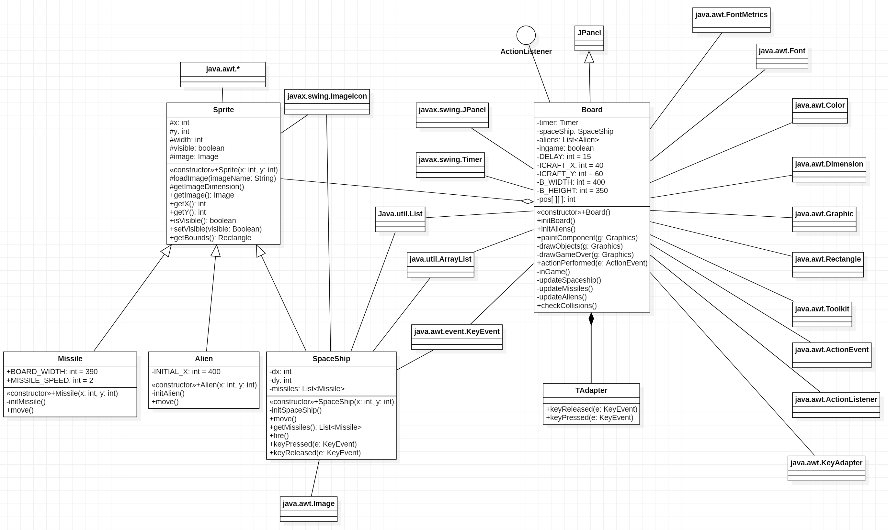

# Collision Detection

Game 2D sederhana yang tujuan utamanya mengalahkan semua alien, dan menghindari pesawat agar tidak bertabrakan dengan alien.

### Class Pada Program Ini
*  Sprite
*  SpaceShip
*  Missile
*  Alien
*  Board
*  MainApp

## Sprite
Class ini merupakan parent dari beberapa class yang nanti digunakan pada program ini. Terdapat beberapa fungsi common yang digunakan oleh child dari class ini.
* `Sprite()`
```java
public Sprite(int x, int y) {
        this.x = x;
        this.y = y;
        visible = true;
    }
```
Constructor dari class Sprite, menerima x dan y yang merepresentasikan posisi awal object yang nanti akan digambar pada Board.

* `loadImage()`
```java
protected void loadImage(String imageName) {
        ImageIcon ii = new ImageIcon(imageName);
        image = ii.getImage();
    }
```
Mendapatkan referensi resource image yang merepresentasikan objek tersebut.

* `getBounds()`
```java
public Rectangle getBounds() {
        return new Rectangle(x, y, width, height);
    }
```
Me-return object Rectangle dengan ukuran sesuai dengan image yang terikat dengan object tersebut. Nanti akan digunakan pada `checkCollisions()`


## SpaceShip
Class ini turunan dari sprite.
* `SpaceShip()`
```java
public SpaceShip(int x, int y) {
        super(x, y);

        initSpaceShip();
    }
```
Memanggil constructor dari parent classnya yaitu Sprite.

* `initSpaceShip()`
```java
private void initSpaceShip() {
        missiles = new ArrayList<>();

        loadImage("src/resources/craft.png");
        getImageDimension();
    }
```
Inisiasi ArrayList yang isi datanya bertipe Class Missile, memanggil loadImage untuk bind resource image dengan Classnya.

* `move()`
```java
public void move() {
        if (!(y + dy < 0) && !(y + dy + height > 260)){
            y += dy;
        }

        if(!(x + dx + width > 380) && !(x + dx < 0)){
            x += dx;
        }
    }
```
x dan y merupakan variabel yang merepresentasikan lokasi suatu object pada Class Board sehingga fungsi move adalah merubah nilai x dan y sesuai dengan dy dan dx (perubahan nilainya).

* `fire()`
```java
public void fire() {
        missiles.add(new Missile(x + width, y + height / 2));
    }
```
Fungsi fire akan menambah object Missile ke `List<Missile> missiles` pada Class SpaceShip yang akan dipanggil ketika user menekan spacebar pada keyboard.

* `keyPressed() keyReleased()`
```java
public void keyPressed(KeyEvent e) {
        int key = e.getKeyCode();

        if (key == KeyEvent.VK_SPACE) {
            fire();
        }

        if (key == KeyEvent.VK_LEFT) {
            dx = -2;
        }

        if (key == KeyEvent.VK_RIGHT) {
            dx = 2;
        }

        if (key == KeyEvent.VK_UP) {
            dy = -2;
        }

        if (key == KeyEvent.VK_DOWN) {
            dy = 2;
        }
    }

    public void keyReleased(KeyEvent e) {

        int key = e.getKeyCode();

        if (key == KeyEvent.VK_LEFT) {
            dx = 0;
        }

        if (key == KeyEvent.VK_RIGHT) {
            dx = 0;
        }

        if (key == KeyEvent.VK_UP) {
            dy = 0;
        }

        if (key == KeyEvent.VK_DOWN) {
            dy = 0;
        }
    }
```
Kedua fungsi ini menghandle 'event' yang dilakukan oleh user. Yang terbaca hanyalah empat button arrow pada keyboard untuk menggerakan SpaceShip dan spasi(spacebar) untuk menembakkan missile.

## Missile
Class ini turunan dari sprite.
* `Missile()`
```java
public Missile(int x, int y) {
        super(x, y);

        initMissile();
    }
```
Constructor dari Missile memanggil super constructornya, lalu memanggil `initMissile()` untuk inisialisasi yang dibutuhkan oleh missile.

* `initMissile()`
```java
private void initMissile() {
        loadImage("src/resources/missile.png");
        getImageDimension();
    }
```
Fungsi ini memanggil fungsi dari super classnya untuk bind resource image pada directory project dengan object missile nya.

* `move()`
```java
public void move() {
        x += MISSILE_SPEED;

        if (x > BOARD_WIDTH) {
            visible = false;
        }
    }
```
Fungsi ini berfungsi memindahkan koordinat missile ke arah kanan karena x positif setiap delay yang di set pada timer di Class Board nanti.

## Alien
Class ini turunan dari sprite.
* `Alien()`
```java
public Alien(int x, int y) {
        super(x, y);

        initAlien();
    }
```
Constructor dari alien akan memanggil `initAlien()` untuk inisialisasi resource yang dibutuhkan.

* `initAlien()`
```java
private void initAlien() {
        loadImage("src/resources/alien.png");
        getImageDimension();
    }
```
Fungsi ini akan melakukan bind resource image pada objectnya melalui `loadImage()` dan `getImageDimension()` untuk deklarasi nilai awal ukuran imagenya pada object.

* `move()`
```java
public void move() {
        if (x < 0) {
            x = INITIAL_X;
        }

        x -= 1;
    }
```
Fungsi ini mirip dengan move milik missile hanya saja arah yang berlawanan yaitu ke arah x negatif atau kiri.

## Board
Class ini di extends dari JPanel sebagai fondasi dasar untuk meletakkan object yang ingin digambar nantinya.
* `Board()`
```java
public Board(int x, int y) {
        initBoard();
    }
```
Constructor hanya akan memanggil fungsi lainnya untuk melakukan inisialisasi yang dibutuhkan.

```java
    private final int[][] pos = {
            {2380, 29}, {2500, 59}, {1380, 89},
            {780, 109}, {580, 139}, {680, 239},
            {790, 245}, {760, 50}, {790, 150},
            {980, 209}, {560, 45}, {510, 70},
            {930, 159}, {590, 80}, {530, 60},
            {940, 59}, {990, 30}, {920, 200},
            {900, 245}, {660, 50}, {540, 90},
            {810, 220}, {860, 20}, {740, 180},
            {820, 128}, {490, 170}, {700, 30}
    };
```
Pada class Board ini ada array 2D lokal yang digunakan sebagai posisi dari alien nantinya.

* `initBoard()`
```java
private void initBoard() {

        addKeyListener(new TAdapter());
        setBackground(Color.BLACK);
        setFocusable(true);
        ingame = true;

        setPreferredSize(new Dimension(B_WIDTH, B_HEIGHT));

        spaceShip = new SpaceShip(ICRAFT_X, ICRAFT_Y);

        initAliens();

        timer = new Timer(DELAY, this);
        timer.start();
    }
```
Fungsi `addKeyListener()` menerima parameter class yang di extend dari KeyAdapter yaitu TAdaper yang ada dibagian paling bawah kode. Nanti akan dijelaskan lebih lanjut. `setBackground()` memberikan warna background seperti nama fungsinya pada Class board. `setFocusable()` memberikan permission pada component agar bisa mendapatkan fokus atau tidak tergantung parameternya. `setPreferedSize()` mengatur ukuran dari JPanel yang akan ditampilkan. Bisa dilihat disini juga kita membuat object spaceShip yang terikat pada class Board dan memanggil fungsi `initAliens()` yang diperlukan untuk menginisialisasi object - object Alien nanti. Class Timer yang dibuat disini berfungsi untuk mengatur waktu berlajannya program. Program ini sendiri akan memanggil fungsi yang menggambar ulang keseluruhan object pada tiap waktu yang di set di Timer.

* `initAliens()`
```java
public void initAliens() {
        aliens = new ArrayList<>();

        for (int[] p : pos) {
            aliens.add(new Alien(p[0], p[1]));
        }
    }
```
Fungsi ini membuat object Alien baru sesuai dengan array pos.

* `painComponent()`
```java
public void paintComponent(Graphics g) {
        super.paintComponent(g);

        if (ingame) {
            drawObjects(g);
        }else {
            drawGameOver(g);
        }

        Toolkit.getDefaultToolkit().sync();
    }
```
Fungsi ini yang bertugas menggambar ulang component yang terikat pada JPanel. Jika belum game over ditentukan dengan variable ingame yang bernilai true maka akan memanggil fungsi `drawObjects()` yang nanti akan menggambar ulang semua object dengan koordinat barunya. `drawGameOver()` akan menggambar string dan menghapus semua object pada JPanel.

* `drawObjects()`
```java
private void drawObjects(Graphics g) {

        if (spaceShip.isVisible()) {
            g.drawImage(spaceShip.getImage(), spaceShip.getX(), spaceShip.getY(),
                    this);
        }

        List<Missile> ms = spaceShip.getMissiles();

        for (Missile missile : ms) {
            if (missile.isVisible()) {
                g.drawImage(missile.getImage(), missile.getX(),
                        missile.getY(), this);
            }
        }

        for (Alien alien : aliens) {
            if (alien.isVisible()) {
                g.drawImage(alien.getImage(), alien.getX(), alien.getY(), this);
            }
        }

        g.setColor(Color.WHITE);
        g.drawString("Aliens left: " + aliens.size(), 5, 15);
    }
```
Di sini for pertama akan menggambar semua missile yang ada, lalu for kedua akan menggambar semua alien. Pada bagian akhir potongan code ada `drawString` yang menggambar text pada JPanel.

* `drawGameOver()`
```java
private void drawGameOver(Graphics g) {

        String msg = "Game Over";
        Font small = new Font("Helvetica", Font.BOLD, 14);
        FontMetrics fm = getFontMetrics(small);

        g.setColor(Color.white);
        g.setFont(small);
        g.drawString(msg, (B_WIDTH - fm.stringWidth(msg)) / 2,
                B_HEIGHT / 2);
    }
```
Seperti yang sudah dijelaskan pada bagian `paintComponent()` fungsi ini akan menggambar tulisan game over dan tidak akan menggambar ulang object lainnya. Karena hanya dipanggil ketika game over saja saat ada collision SpaceShip dengan Alien.

* `actionPerformed()`
```java
public void actionPerformed(ActionEvent e) {
        inGame();

        updateSpaceShip();
        updateMissiles();
        updateAliens();

        checkCollisions();

        repaint();
    }
```
Fungsi ini dioverride dari interface ActionListener, akan dipanggil ketika ada event atau trigger tertentu yang dilakukan oleh user dalam program ini adalah ketika ada input dari keyboard atau dengan timer. Di dalam bodynya akan memanggil beberapa fungsi yang meng-update koordinat dari semua object dan mengecek collision. Lalu di akhir memanggil `repain()` untuk menggambar ulang object yang koordinatnya sudah berubah. Fungsi `updateSpaceShip()` hanya merubah koordinat pada spaceShip saja. Sedangkan untuk `updateMissiles()` dan `updateAlliens()` melakukan perubahan koordinat pada beberapa object sehingga dilakukan loop nantinya.

* `inGame()`
```java
    private void inGame() {
        if (!ingame) {
            timer.stop();
        }
    }
```
Fungsi ini akan menghentikan timer jika sudah game over sehingga tidak perlu lagi memanggil action performed.

* `checkCollisions()`
```java
public void checkCollisions() {

        Rectangle r3 = spaceShip.getBounds();

        for (Alien alien : aliens) {

            Rectangle r2 = alien.getBounds();

            if (r3.intersects(r2)) {

                spaceShip.setVisible(false);
                alien.setVisible(false);
                ingame = false;
            }
        }

        List<Missile> missiles = spaceShip.getMissiles();

        for (Missile missile : missiles) {

            Rectangle r1 = missile.getBounds();

            for (Alien alien : aliens) {

                Rectangle r2 = alien.getBounds();

                if (r1.intersects(r2)) {

                    missile.setVisible(false);
                    alien.setVisible(false);
                }
            }
        }
    }
```
Pada dasarnya ini akan melakukan pemeriksaan atau check pada object - object yang ada di JPanel. Dilakukan dengan mendapatkan object Rectangle pada tiap jenis class, ketika ada yang saling bertindih(intersect) maka akan ada perlakukan tertentu. Ada beberapa behavior yaitu jika spaceship bertindihan dengan alien maka akan gameover, jika missile bertindihan dengan alien maka kedua object yang saling bertingihan akan menghilang. Terakhir spaceship dan missil tidak akan bisa bertubrukan. Karena kecepatan missile dan spaceship untuk bergerak ke arah x positif sama.

## TAdaper
```java
    private class TAdapter extends KeyAdapter {

        @Override
        public void keyReleased(KeyEvent e) {
            spaceShip.keyReleased(e);
        }

        @Override
        public void keyPressed(KeyEvent e) {
            spaceShip.keyPressed(e);
        }
    }
```
Class ini digunakan sebagai eventListener pada program ini.

## MainApp
Class ini hanya berfungsi sebagai penyedia window untuk meletakan class Board yang telah kita buat.

## Class Diagram


## Running Program Image

