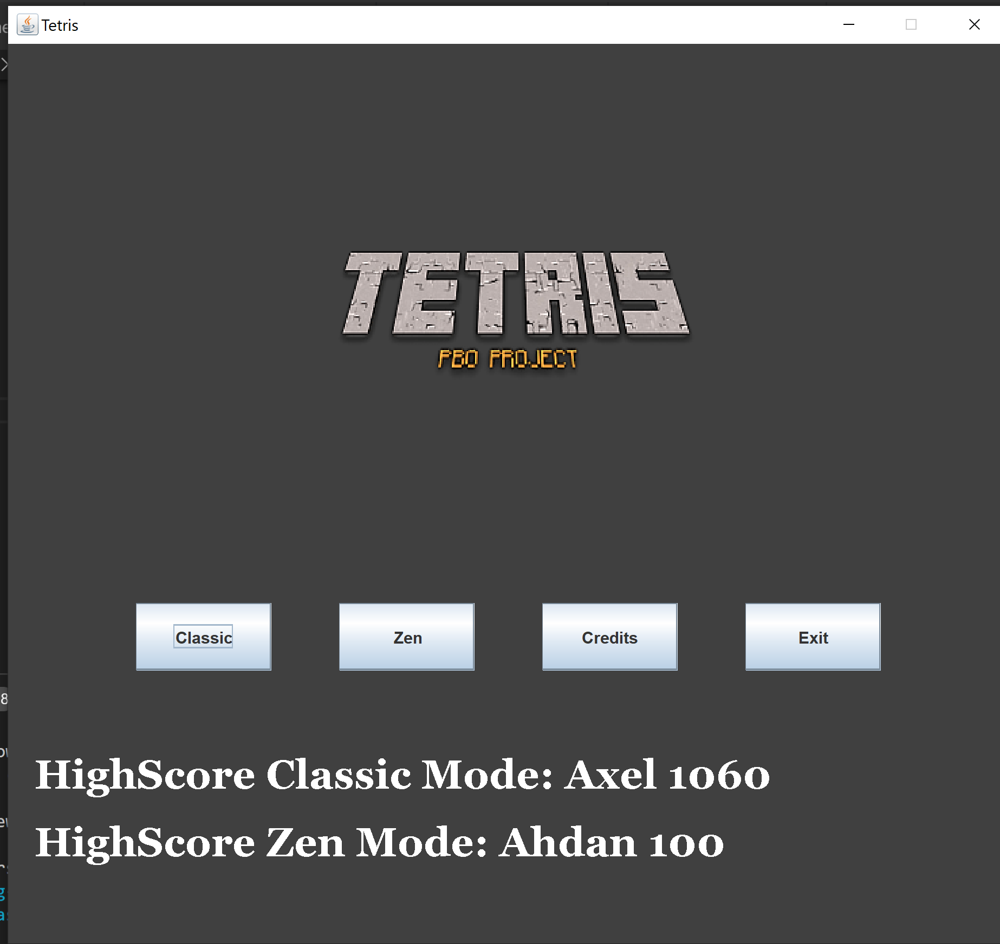
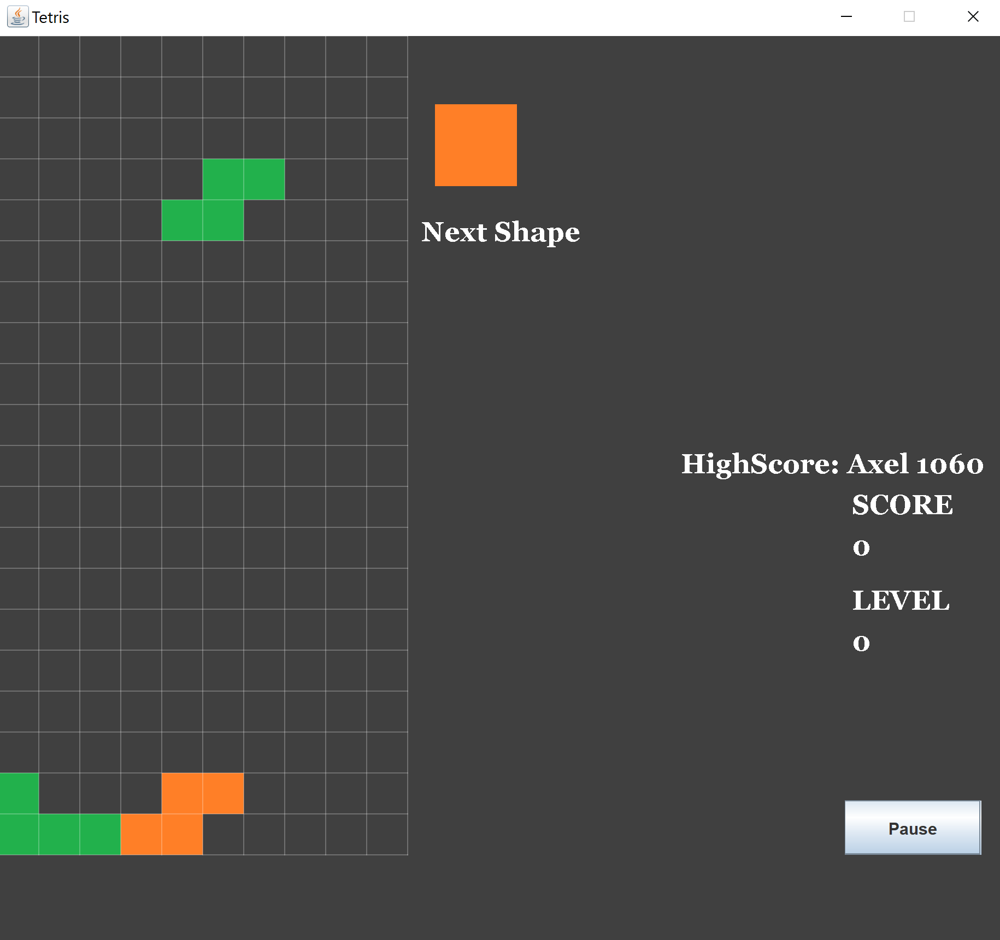
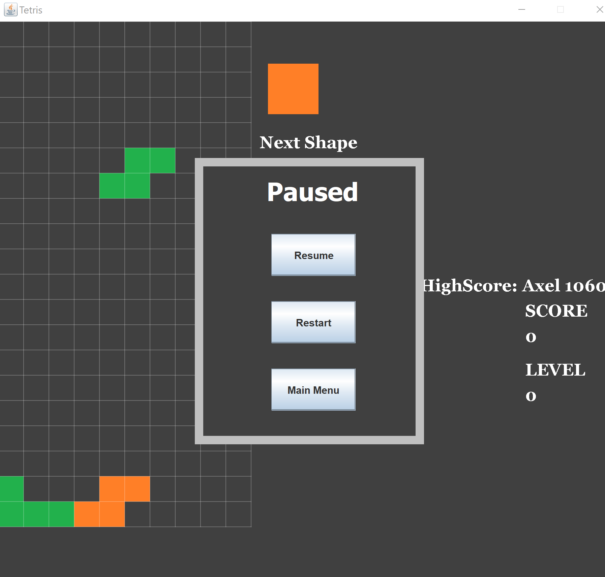
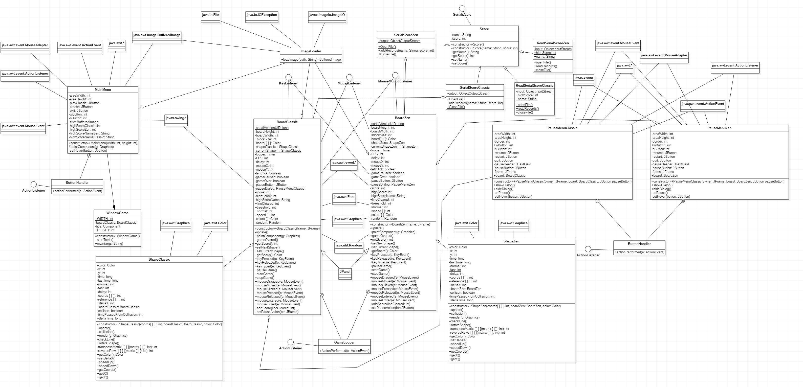

# Tetris

## Jenis yang akan diambil : Game
Game development dengan konsep tetris

## Fitur di game
- Classic
  - Kecepatan turun block bertambah sesuai dengan line block yang sudah dihancurkan
- Zen Mode
  - Kecepatan turun block tidak akan bertambah
- High score untuk tiap mode
- Main screen
  - Memuat menu pilihan untuk mode gamenya serta credit dan exit button
- Credit screen
  - Memuat identitas developer final project ini

## Deskripsi Game
Di game Tetris ini akan menggunakan class `BoardClassic`,`BoardZen`,`ImageLoader`,`MainMenu`,`PauseMenuClassic`,`PauseMenuZen`,`ReadSerialScoreClassic`,`ReadSerialScoreZen`,`Score`,`SerialScoreClassic`,`SerialScoreZen`,`ShapeClassic`,`ShapeZen`,`WindowGame` dengan detail nya sebagai berikut:

### WindowGame
Merupakan class utama yang berisi main method sebagai titik awal project dijalankan
### MainMenu 
Class yang pertama kali dimunculkan ketika menjalankan game, akan memuat menu - menu yang tersedia pada game ini.
### BoardClassic
Merupakan extensi dari JPanel untuk memuat component yang dibutuhkan pada mode classic, pada class ini juga didefinisikan bentuk dari tiap shape ke dalam sebuah array dua dimensi. Selain itu logic penhhitungan score, dan kecepatan vertical dari shape ada pada class ini.
### ShapeClassic
Class ini memuat logic pergerakan dari shape(block) seperti seberapa cepat turun ke bawah, seberapa cepat pergeseran pada sumbu x nya, bagaimana cara shape dapat rotate. Logic collition detection dan memuat variabel boardnya untuk mengetahui shape ini terikat pada board yang mana.
### PauseMenuClassic
Sebuah extensi dari JDialog untuk menampilkan dialog pause ketika gamenya sedang dipause. Memiliki beberapa menu pilihan didalamnya yaitu resume, restart, dan main menu. Pada class ini juga memiliki variabel board yang bertipe `BoardClassic` yang digunakan untuk mengatur behaviour dari dialognya.
### BoardZen
Sangat mirip dengan class `BoardClassic` hanya saja tidak memuat logic untuk mengatur kecepatan vertical dari shape.
### ImageLoader
Class ini digunakan untuk load gambar yang diperlukan nantinya oleh class lain dan ditampilkan di board dan juga melemparkan exeption jika load gambar gagal.
### CreditScene
JPanel untuk menampilkan developer game ini.

Untuk Class `ShapeZen` dan `PauseMenuZen` sama seperti varian Classic nya hanya berbeda untuk variabel board di dalam classnya bertipe `BoardZen`. Adapun perbedaan project ini dengan referensi adalah pada referensi kita mengambil logic untuk melakukan collision detection, cara mendefinisikan bentuk shape, cara mengisi boardnya, cara untuk merotate shape. Intinya kita mengambil logic game tetris nya saja. Sedangkan untuk class dan logic lainnya kita implementasikan sendiri, seperti untuk membuat score, main menu, pause dialog, scoring system, credit, mode game dan lainnya.

### Serializable Scoring
Di sistem serializable scoring terdapat class `ReadSerialScoreClassic`, `ReadSerialScoreZen`, `Score`, `SerialScoreClassic`, `SerialScoreZen`. Pada class bagian `SerialScoreClassic` dan `SerialScoreZen` berfungsi sebagai sistem penyimpan file untuk nama dari highscore board. Jadi board akan pass nama dan highscore ke Serial Score lalu akan menyimpannya di sebuah file. Pada bagian class `ReadSerialScoreClassic` dan `ReadSerialScoreZen` berfungsi sebagai pembaca dari file yang telah disimpan agar nantinya score yang telah disimpan akan ditampilkan di game nya. 

Class `Score` berfungsi sebagai objek yang nantinya bagian Serial dan ReadSerial akan menyimpan & membaca "objek" dalam file tsb sehingga tipe data juga tersimpan dan dapat terbaca. Class `Score` mengimplementasikan Serializable.

## Gambar Game

## Diagram

## Link Referensi
[Link Referensi Pembuatan Game Tetris](https://www.youtube.com/watch?v=_U0Io6Utf98&list=PLOgQJY7VjpBRpszgw5PfuJlOUQgIVMz5c)
## Link Youtube
[Link Presentasi Game Tetris](https://youtu.be/XnjQAsRNEiE)
