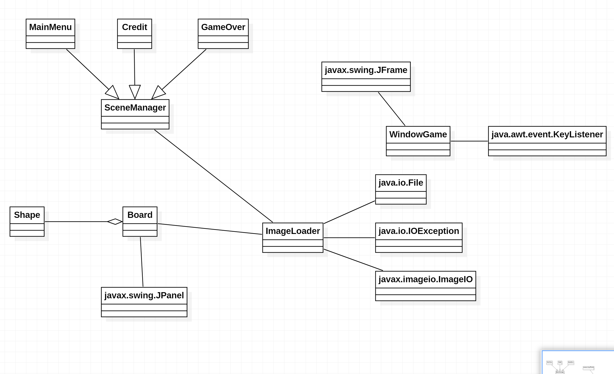

# Progress Final Project

## Jenis yang akan diambil : Game
Game development dengan konsep tetris

## Deskripsi Game
Di game Tetris ini akan menggunakan class `Shape`,`Board`,`ImageLoader`,`WindowGame`,`SceneManager`,`MainMenu`,`LevelSelector`,`GameOver`,`Credit` dengan fitur nya sebagai berikut:
### Shape
Class ini digunakan untuk menampung/create bentuk-bentuk balok yang akan dirandom generate (Tetris Block).
### ImageLoader
Class ini digunakan untuk load gambar yang diperlukan nantinya oleh class lain dan ditampilkan di board dan juga melemparkan exeption jika load gambar gagal.
### SceneManager
Class ini digunakan untuk mengatur scene-scene seperti `MainMenu`, `LevelSelector`,`GamwOver`,dan `Credit`.
### WindowGame
Class ini digunakan sebagai Main Class yang mengatur besar width/hight dari window game dan inisialisasi objek yang akan digunakan.

## Fitur di game
- Classic tetris
- Challange mode
  - Di awal permainan, boardnya sudah di isi oleh random block dengan ketinggian tertentu
- High score
- Main screen
  - Untuk melihat lihat high score dan memilih mode game
- Credit screen

## Diagram (Sementara)

## Link Referensi
[Link Referensi Pembuatan Game Tetris](https://www.youtube.com/watch?v=_U0Io6Utf98&list=PLOgQJY7VjpBRpszgw5PfuJlOUQgIVMz5c)
